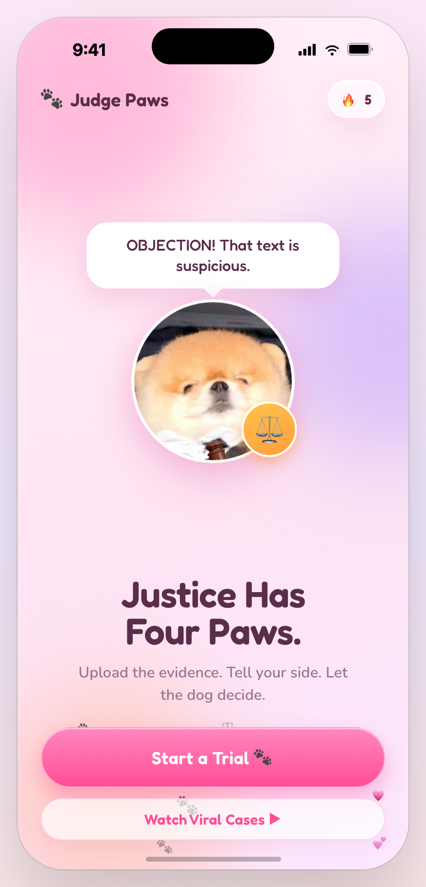
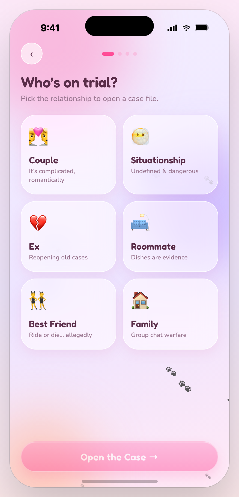
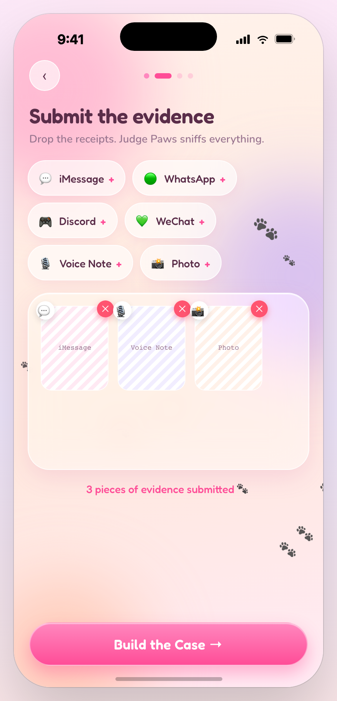
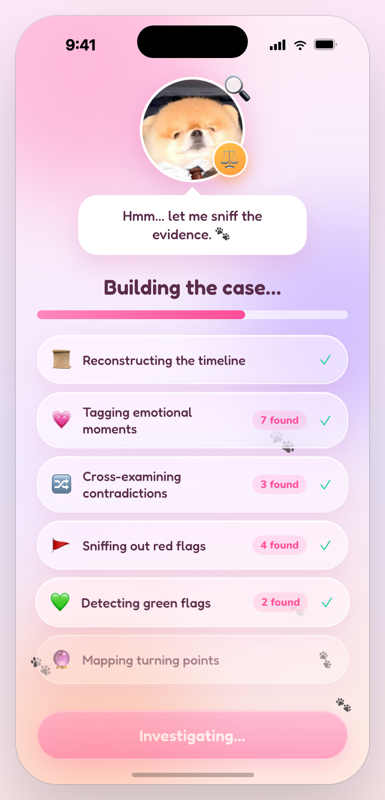
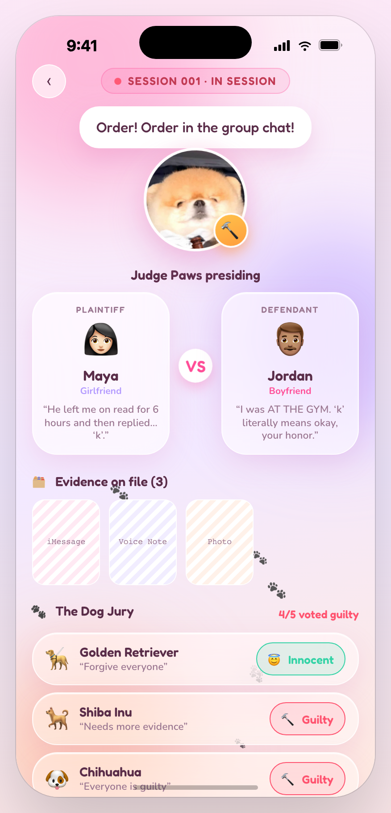
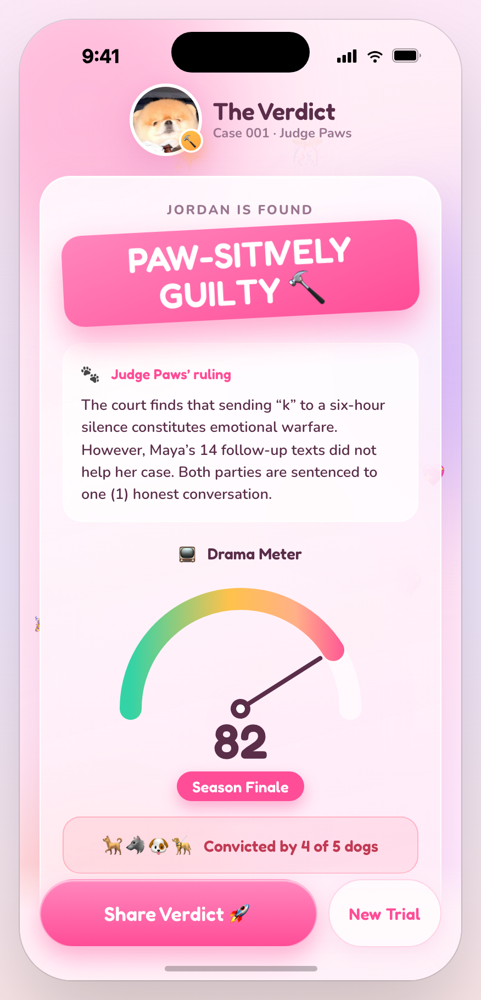

# ⚖️🐾 Judge Paw

> An AI judge that hears both sides of a couple's argument and delivers a playful — but fair — verdict.

Built **From Board to Build** for the **Miro × Kiro LA Hackathon**: planned in Miro, shipped with Kiro.

<p align="center">
  
</p>

### Screens

<p align="center">
  
  
  
  
  
  
</p>
<p align="center"><sub>Home · Pick the relationship · Submit evidence · Build the case · Courtroom & dog jury · Verdict</sub></p>

---

## The problem

Every couple has the same unsolved workflow: *"who's actually right here?"* — settled today by sulking, guessing, or asking a group chat. There is no neutral third party. The dispute stalls, nobody feels heard, and the same fight repeats next week.

**Judge Paw** is that neutral third party: a (very cute) AI judge that takes both partners' statements, weighs them, and issues a verdict with a ruling, the reasoning, and a "sentence" — a small make-up action to close the case.

## How it works

```
Partner A states their case   ─┐
                               ├─►  Judge Paw  ─►  ⚖️ VERDICT
Partner B states their case   ─┘                   • Ruling (who, how much)
                                                    • Reasoning (fair, sees both sides)
                                                    • Sentence (a make-up action)
```

## Demo flow (3-min pitch)

1. **The board** — a Miro board lays out the courtroom: the user journey, the "judicial process," and why this workflow is broken today.
2. **The build** — open Judge Paw, both partners type their side, hit **Render Verdict**.
3. **The verdict** — Judge Paw delivers a warm, funny, genuinely-balanced ruling. Case closed. 🐾

## Board → Build

| Stage | Tool | Artifact |
|-------|------|----------|
| Plan  | **Miro** | Public board: strategy, user journey, judicial process, metrics, pitch |
| Build | **Kiro** | This repo — spec-driven, see [`.kiro/specs/`](.kiro/specs/judge-paw/) |
| Ship  | —    | Working prototype + 3-min demo |

### Built with Kiro (spec-driven)

This app wasn't hand-written — it was built with [Kiro](https://kiro.dev)'s spec-driven workflow. The living spec lives in [`.kiro/specs/judge-paw/`](.kiro/specs/judge-paw/):

- [`requirements.md`](.kiro/specs/judge-paw/requirements.md) — user stories + acceptance criteria
- `design.md` — technical design _(generated next in Kiro)_
- `tasks.md` — implementation checklist _(generated next in Kiro)_

## Tech stack

- **Frontend:** single-file prototype (`index.html`) — React rendered in-browser, no build step
- **Planning:** Miro Developer Platform
- **Built with:** Kiro (AI IDE, spec-driven development)
- **AI verdict engine:** a Node + **Claude Opus 4.8** backend powers real AI verdicts —
  developed separately as a **[full-stack build →](https://github.com/SkylarWJY/judge-paws)**
  (landing + waitlist + court app + verdict API), by Skylar.

## Try it

Open `index.html` in a browser (or visit the GitHub Pages deployment). The prototype runs
the full courtroom flow on sample data — pick a relationship type, review the "evidence,"
and Judge Paws delivers the verdict. 🐾

## Links

- 🎨 Miro board: _(add public link)_
- 🎬 Demo video: _(add link)_

---

## Credits & Roles

Judge Paws was built for the **Miro × Kiro LA Hackathon**. Roles below; full authorship
is verifiable in the commit history (`git shortlog -sne`).

| Person | Role |
|--------|------|
| **Skylar** ([@SkylarWJY](https://github.com/SkylarWJY)) | **Concept & product vision** · **UI/UX design** · **landing page** · **full build** — interactive app + AI verdict engine (Node + Claude Opus 4.8, in a separate full-stack repo) · Miro planning · Kiro specs (`.kiro/specs/`) · pitch deck |
| **Justina** | Pitch & narrative · slide design · QA testing · demo prep · team coordination |
| **Jade** ([@dxj1031](https://github.com/dxj1031)) | Deployment & DevOps · GitHub Pages CI/CD · Miro × Kiro integration & tooling · repository setup · infra & technical coordination |

> **Provenance.** Every commit in this repo is authored by its real contributor — run
> `git shortlog -sne` or check the GitHub *Contributors* graph to see exactly who wrote
> what. The concept, design, landing page, and full-stack implementation were authored
> by Skylar.

## Status

🚧 Hackathon build in progress — Miro × Kiro LA Hackathon.

## License

[MIT](LICENSE)
